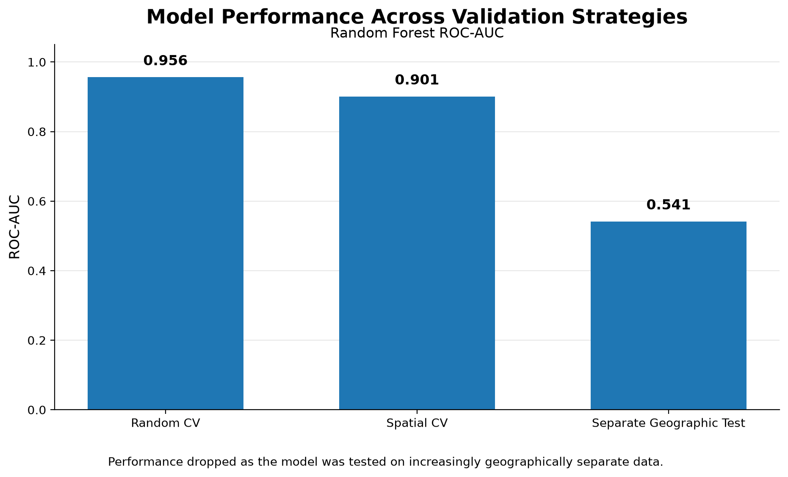

# New Mexico Wildfire Susceptibility with Machine Learning

A reproducible geospatial machine-learning workflow for modeling wildfire susceptibility from environmental characteristics and testing how well those relationships transfer to geographically separate areas.


> **Portfolio case study:** [New Mexico Wildfire Susceptibility with Machine Learning](https://fluidthinker.github.io/projects/wildfire-susceptibility/)

The project integrates topography, vegetation, long-term precipitation, and historical wildfire occurrence on a common 1-km grid across New Mexico. Logistic Regression and Random Forest models were evaluated using both conventional random cross-validation and spatial cross-validation, followed by a separate geographic test.

The central finding was that model performance depended strongly on validation design. The baseline Random Forest achieved ROC-AUC 0.956 under random cross-validation and 0.901 under spatial cross-validation, but only 0.541 on the separate geographic test area.

Strong cross-validation performance did not guarantee strong geographic transfer.

---

## Research Question

Which relatively stable environmental characteristics distinguish areas of New Mexico that have historically experienced wildfire from areas that have not, and how well do those relationships hold up in areas the model has not seen before?

This project focuses on **biophysical wildfire susceptibility** rather than short-term fire prediction.

It does not attempt to predict:

- the next ignition
- current fire danger
- wildfire spread
- annual burn probability
- operational wildfire risk

---

## Key Results

### Baseline Random Forest

| Validation strategy | ROC-AUC | Average Precision |
|---|---:|---:|
| Random cross-validation | 0.956 | 0.484 |
| Spatial cross-validation | 0.901 | 0.230 |
| Separate geographic test | 0.541 | 0.014 |

The progressively harder geographic tests produced progressively weaker results.

Random cross-validation gave the strongest performance estimate, while spatial cross-validation was more conservative. The separate geographic test revealed that the model transferred poorly into a substantially different part of New Mexico.

A small post-hoc Random Forest tuning exercise improved the geographic-test ROC-AUC only modestly:

- Baseline geographic test ROC-AUC: **0.541**
- Tuned post-hoc geographic test ROC-AUC: **0.570**
- Baseline geographic test Average Precision: **0.014**
- Tuned post-hoc geographic test Average Precision: **0.015**

Because the geographic-test result had already been observed before tuning, the tuned result is treated as a **post-hoc learning exercise**, not a new independent final test.

---

## Validation Performance




The chart shows the baseline Random Forest under three increasingly geographically demanding evaluation strategies:

1. Random cross-validation
2. Spatial cross-validation
3. A separate geographic test area

The purpose of the comparison is not to argue that one validation method is universally better. It shows how much the estimated performance changed when the model was tested on increasingly separate geography.

---

## Data Sources

### USGS 3DEP

Used for terrain variables:

- elevation
- slope
- aspect

Terrain was derived from 10-m 3DEP elevation data and summarized to the 1-km analysis grid.

### PRISM

Used for long-term annual precipitation.

The project uses long-term climate normals rather than short-term fire-weather conditions.

### LANDFIRE Existing Vegetation Type

Used to represent vegetation composition.

For each 1-km analysis cell, the dominant EVT class and dominant-class fraction were summarized from the underlying categorical raster.

### Monitoring Trends in Burn Severity

MTBS wildfire perimeters were used to construct the historical wildfire target.

The target identifies whether a 1-km grid cell intersected an MTBS-mapped wildfire during the selected 2017-2022 study period.

Cells labeled as unburned therefore mean:

**no mapped MTBS wildfire during the study period**

rather than:

**fire has never occurred there.**

### U.S. Census TIGER/Line

Used for the New Mexico study-area boundary and map context.

---

## Analysis Grid

The project uses a regular **1-km x 1-km grid** in:

`EPSG:5070`

Grid cells were retained when their centroid fell within the New Mexico boundary.

The statewide grid contains:

- **314,920 total cells**

The labeled modeling population contains:

- **313,129 cells**
- **7,406 positive cells**
- **305,723 negative cells**

An additional **1,791 target-ambiguous cells** were excluded during supervised model development but later received susceptibility estimates when the statewide prediction surface was generated.

---

## Predictors

The modeling dataset contains the following environmental predictors:

### Terrain

- `elevation_mean`
- `elevation_std`
- `slope_mean`
- `slope_std`
- `aspect_sin_mean`
- `aspect_cos_mean`
- `aspect_strength`

### Climate

- `annual_precip_mean`

### Vegetation

- `evt_dominant_class`
- `evt_dominant_fraction`

The modeling target is:

- `target`

The target-derived `burned_fraction` field is excluded from downstream predictors to avoid leakage.

---

## Modeling Workflow

```text
New Mexico boundary
        ↓
1-km analysis grid
        ↓
USGS 3DEP
PRISM
LANDFIRE EVT
MTBS
        ↓
Feature engineering + QA/QC
        ↓
ML-ready dataset
        ↓
Logistic Regression
Random Forest
        ↓
Random vs spatial cross-validation
        ↓
Random Forest tuning using spatial CV
        ↓
Separate geographic test
        ↓
Compare test area with training area
        ↓
Interpret environmental differences and model limitations
        ↓
Fit final statewide model using all labeled cells
        ↓
Create statewide susceptibility surface
        ↓
Build interactive Folium map
```

---

## Modeling Design

Two supervised classification models were evaluated.

### Logistic Regression

Used as a simpler baseline model.

### Random Forest

Used to capture nonlinear relationships and interactions among environmental predictors.

All model evaluation was performed using saved training and validation assignments so experiments could be compared consistently.

---

## Random Cross-Validation

Random cross-validation mixes locations from across the training population among validation folds.

For the Random Forest:

- ROC-AUC: **0.956**
- Average Precision: **0.484**

This produced the strongest apparent model performance.

---

## Spatial Cross-Validation

To make validation more geographically separated, the training region was grouped into approximately **50-km spatial blocks**.

Complete blocks were kept together within validation folds.

For the baseline Random Forest:

- ROC-AUC: **0.901**
- Average Precision: **0.230**

Performance was lower than under random cross-validation, suggesting that random validation gave a more optimistic estimate of performance for geographically separated data.

---

## Separate Geographic Test

A separate eastern band of spatial blocks was reserved before model development.

This geographic test contained:

- **60,560 cells**
- **821 positive cells**
- **59,739 negative cells**
- positive prevalence: **1.36%**

The baseline Random Forest achieved:

- ROC-AUC: **0.541**
- Average Precision: **0.014**

This was substantially weaker than both random and spatial cross-validation.

---

## Why Did the Geographic Test Perform Poorly?

Rather than immediately trying more algorithms, the project compared environmental conditions in the training population and test area.

Major differences included:

| Characteristic | Training | Geographic test |
|---|---:|---:|
| Mean elevation | 1,846 m | 1,394 m |
| Mean slope | 6.39° | 2.17° |
| Mean annual precipitation | 350 mm | 400 mm |
| Historical wildfire prevalence | 2.61% | 1.36% |

Vegetation composition also differed substantially.

For example, one LANDFIRE EVT class represented approximately:

- **11% of training cells**
- **52% of test-area cells**

Among positive wildfire cells, the environmental differences were even larger:

- Mean elevation: **2,355 m training vs 1,354 m test**
- Mean slope: **16.0° training vs 2.8° test**

These diagnostics do not prove that the environmental shifts caused the model-performance decline.

They do show that the model was being asked to transfer into an environmental setting that differed substantially from much of the training population.

---

## Hyperparameter Tuning

A small Random Forest tuning experiment tested five predefined model configurations using the frozen spatial cross-validation folds.

The selected configuration used:

- `n_estimators = 300`
- `max_depth = 30`
- `min_samples_leaf = 5`

The improvement in spatial cross-validation Average Precision was very small:

- Baseline mean AP: **0.247**
- Tuned mean AP: **0.248**

This suggested that modest Random Forest tuning was not the main limitation.

Geographic differences in the data mattered far more than small changes to model complexity.

---

## Final Statewide Susceptibility Surface

After model evaluation was complete, the selected Random Forest was fit using all available labeled modeling cells.

The fitted model was then applied to all:

- **314,920 statewide 1-km cells**

The resulting statewide output is stored as:

`data/processed/modeling/nm_statewide_susceptibility.geoparquet`

The output contains:

- `cell_id`
- `susceptibility_probability`
- `geometry`

These values represent **model-estimated wildfire susceptibility**.

They should not be interpreted as:

- validated wildfire risk
- ignition probability
- annual burn probability
- real-time fire danger
- operational hazard forecasts

---

## Interactive Map

The project includes a lightweight interactive Folium map:

`outputs/maps/nm_wildfire_susceptibility_interactive.html`

The statewide susceptibility surface is rasterized for browser display rather than loading more than 300,000 interactive polygons.

This keeps the web map fast and portable while preserving the underlying GeoParquet dataset as the authoritative analytical output.

The map includes:

- statewide model-estimated susceptibility
- New Mexico boundary
- geographic test-area outline
- restrained topographic context
- susceptibility legend
- interpretation caveat

The map is designed for presentation rather than cell-level querying.

---

## Technologies

### Geospatial and Data Engineering

- Python
- GeoPandas
- Rasterio
- Rioxarray
- Xarray
- Dask
- Xarray-Spatial
- STAC
- pystac-client
- Microsoft Planetary Computer
- DuckDB
- GeoParquet
- PyProj

### Machine Learning

- scikit-learn
- Logistic Regression
- Random Forest
- spatial cross-validation
- hyperparameter tuning

### Visualization

- Matplotlib
- Folium

---

## Repository Structure

```text
wildfire-susceptibility-ml/
│
├── analysis/
│   ├── data acquisition and QA/QC scripts
│   ├── feature engineering workflows
│   ├── model training and validation
│   ├── geographic diagnostics
│   └── presentation outputs
│
├── data/
│   ├── raw/
│   ├── interim/
│   └── processed/
│
├── outputs/
│   ├── figures/
│   ├── maps/
│   └── modeling/
│
├── src/
│   └── wildfire_susceptibility/
│       └── reusable project logic
│
├── environment.yml
└── README.md
```

The `analysis/` directory uses VS Code-compatible Python scripts with `# %%` cells for interactive development and review.

Reusable project logic is placed in:

`src/wildfire_susceptibility/`

---

## Reproducibility

The project uses a Conda environment defined in:

`environment.yml`

Recommended setup:

```bash
conda env create -f environment.yml
conda activate wildfire-ml
python -m pip install -e .
```

If the environment already exists:

```bash
conda env update -f environment.yml
conda activate wildfire-ml
python -m pip install -e .
```

Large raw and intermediate geospatial datasets are intentionally excluded from Git.

The repository focuses on reproducible code, project structure, modeling outputs, figures, and documentation.

---

## Limitations

- The target represents MTBS-mapped wildfire occurrence from 2017-2022 rather than all wildfire activity.
- Cells labeled as unburned mean no mapped MTBS wildfire during the study period, not that wildfire has never occurred there.
- The predictors emphasize relatively stable environmental conditions rather than dynamic fire-weather variables.
- Human ignition and accessibility variables were intentionally excluded from the modeling scope.
- Only one separate geographic test region was evaluated.
- The geographic test performed poorly, indicating limited transfer into that environmental setting.
- The statewide susceptibility surface is exploratory and should not be used for operational wildfire decisions.
- The 50-km spatial blocks were a pragmatic validation design rather than a statistically derived spatial-dependence distance.

---

## What I Learned

The most important lesson from this project was that a strong machine-learning score does not automatically mean a spatial model will work well in new geography.

Random cross-validation made the Random Forest look very strong.

Spatial cross-validation gave a more conservative estimate.

The separate geographic test revealed much weaker transfer.

A useful general lesson is:

> Choosing a good algorithm matters, but so does testing it in a way that reflects where the model will actually be used.

The project also reinforced that hyperparameter tuning cannot automatically solve geographic transfer problems when the training and application environments differ substantially.

---

## What I Would Do Differently in a Production Project

In a production consulting or decision-support setting, the weak geographic transfer would become a model-development decision point rather than the end of the workflow.

I would consider:

- evaluating several geographically distinct holdout regions
- investigating environmental extrapolation more explicitly
- mapping where predictions are well supported by the training data
- testing region-specific or ecoregion-aware models
- revisiting spatial-block design using evidence about spatial dependence
- incorporating additional wildfire drivers when justified by the prediction question
- adding dynamic fire-weather variables for a different modeling objective
- incorporating ignition-related variables if the goal shifted from biophysical susceptibility to wildfire occurrence
- quantifying prediction uncertainty
- producing a model-applicability or confidence surface alongside the susceptibility map

A production workflow could therefore produce both:

```text
Wildfire susceptibility map
+
Model applicability / confidence map
```

The second product would help answer an equally important question:

**Where should the susceptibility map be trusted?**

---

## Project Takeaway

This project began as a wildfire-susceptibility modeling exercise and became a deeper lesson in spatial model validation.

The strongest result was not the highest ROC-AUC.

It was discovering that the model's apparent performance changed substantially when the evaluation became more geographically realistic.

That result shaped how the final map was interpreted and reinforced a broader principle of applied geospatial machine learning:

**A spatial model should be judged not only by how well it fits known data, but by how well it transfers to the places where it is intended to be used.**